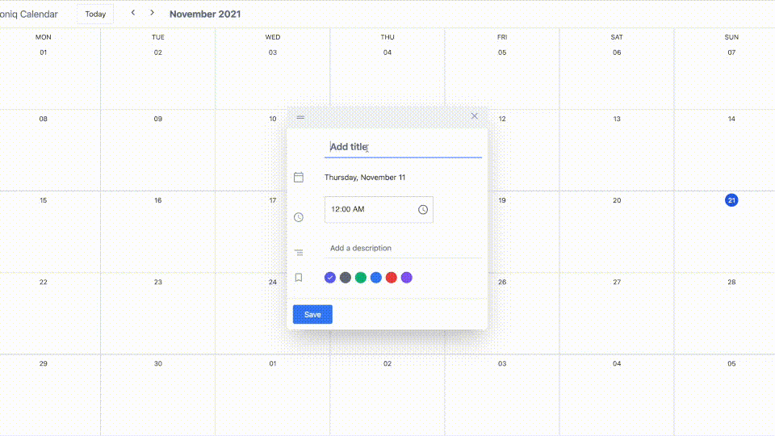

# Full-Stack Calendar Event Application - Soniq Code Challenge

This is a full-stack application and it is created for the Soniq company in order to show coding skills. Client-side is built using React.js, and the backend-side is created with Node.js (Express.js). 

This is a calendar application where you can create, update, view, and delete events.

The app is built using react query, redux, hooks, tailwind.css. It also contain; swagger, docker, webpack, babel, eslint, husky, jest.


## Table of Contents
- [Project Overview](#projectoverview)
- [Installation](#installation)
- [Test](#test)
- [Documentation](#documentation)
- [Structure](#structure)
- [Support](#support)
- [Contributing](#contributing)


### ProjectOverview

A short overview of the project



## Installation
### with Docker
```sh
git clone https://github.com/mJiyan/calendar-event.git
cd calendar-event-soniq
docker-compose up --build

-> Open your browser at http://0.0.0.0:8080 
```

### manually
```sh
git clone https://github.com/mJiyan/calendar-event.git

cd calendar-event-soniq/server
yarn
yarn start

cd calendar-event-soniq/server
yarn
yarn start

Open your browser at http://0.0.0.0:8080 
```


## Test
```sh

In order to see swagger documentation:
git clone https://github.com/mJiyan/calendar-event.git

cd calendar-event-soniq/server
yarn
yarn test

cd calendar-event-soniq/client
yarn
yarn test

```


## Documentation
```sh

In order to see swagger documentation:
git clone https://github.com/mJiyan/calendar-event.git

cd calendar-event-soniq/server
yarn
yarn start

## Then open the: http://localhost:8081/api-docs
```

## Structure
```

├─ client
│   ├─ __test__
│   │  ├─ setup
│   │  │  └─ setupTest.js
│   │  ├─ Calendar.test.js
│   │  └─ Header.test.js
│   ├─ .huksy
│   │  ├─ pre-commit
│   │  └─ pre-push
│   ├─ public
│   │  └─ index.html
│   │
│   ├─ src
│   │  ├─ assets
│   │  │  └─ style
│   │  │     └─ tailwind.css
│   │  │
│   │  ├─ components
│   │  │  ├─ Day
│   │  │  │  └─ Day.jsx
│   │  │  ├─ EventModal
│   │  │  │  └─ EventModal.jsx
│   │  │  ├─ Header
│   │  │  │  └─ Header.jsx
│   │  │  ├─ Month
│   │  │  │  └─ Month.jsx
│   │  │  └─ index.js
│   │  │
│   │  ├─ redux
│   │  │  ├─ actions
│   │  │  │  ├─ Day
│   │  │  │  │   ├─ index.js
│   │  │  │  │   └─ types.js
│   │  │  │  ├─ Event
│   │  │  │  │   ├─ index.js
│   │  │  │  │   └─ types.js
│   │  │  │  ├─ Modal
│   │  │  │  │   ├─ index.js
│   │  │  │  │   └─ types.js
│   │  │  │  └─ Month
│   │  │  │     ├─ index.js
│   │  │  │     └─ types.js
│   │  │  └─ reducers     
│   │  │     ├─ Day
│   │  │     │   └─ index.js
│   │  │     ├─ Event
│   │  │     │   └─ index.js
│   │  │     ├─ Modal
│   │  │     │   └─ index.js
│   │  │     │ Month
│   │  │     │   └─ index.js
│   │  │     └─ index.js
│   │  │
│   │  ├─ routes
│   │  │  └─ index.js
│   │  │
│   │  ├─ services
│   │  │  ├─ api.js
│   │  │  └─ constants.js
│   │  │
│   │  ├─ views
│   │  │  ├─ Calendar
│   │  │  │  └─ Calendar.jsx
│   │  │  └─ index.js
│   │  │
│   │  ├─ configureStore.js
│   │  ├─ index.js
│   │  └─ reducers.js
│   │
│   ├─ .dockerignore
│   ├─ .eslintrc
│   ├─ .gitignore
│   ├─ .prettierrc
│   ├─ babel.config.js
│   ├─ docker-compose.yaml
│   ├─ Dockerfile
│   ├─ jest.config.js
│   ├─ LICENSE
│   ├─ postcss.config.js
│   ├─ tailwind.config.js
│   └─ package.json
│   └─ webpack.config.js
├─ server
│   ├─ src
│   │  ├─ api
│   │  │  ├─ controllers
│   │  │  │  └─ eventController.js
│   │  │  ├─ routes
│   │  │  │  ├─ eventRoutes.js
│   │  │  │  └─ routeManager.js
│   │  │  └─ swagger
│   │  │     └─ swagger.yaml
│   │  ├─ config
│   │  │  ├─ index.js
│   │  │  ├─ logger.config.js
│   │  │  └─ swagger.config.js
│   │  ├─ loaders
│   │  │  ├─ express.js
│   │  │  ├─ index.js
│   │  │  └─ mongoose.js
│   │  ├─ models
│   │  │  ├─ index.js
│   │  │  └─ eventModel.js
│   │  └─ app.js
│   ├─ test
│   │  └─ api
│   │     ├─ controllers
│   │     │  ├─ event.test.js
│   │     │  └─ index.test.js
│   │     └─ helpers
│   │        └─ test.model.json
│   ├─ .dockerignore
│   ├─ .env
│   ├─ .gitignore
│   ├─ docker-compose.yaml
│   ├─ Dockerfile
│   ├─ LICENSE
│   └─ package.json
├─ docker-compose.yml
└─ README.md


```

## Support

Please [open an issue](https://github.com/mJiyan/calendar-event/issues) for support & suggestions.


## Contributing

Please contribute using [Github Flow](https://guides.github.com/introduction/flow/). Create a branch, add commits, and [open a pull request](https://github.com/mJiyan/calendar-event/compare).
